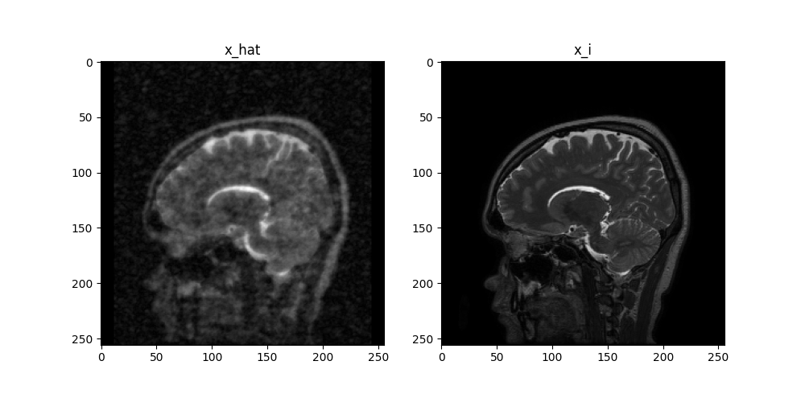
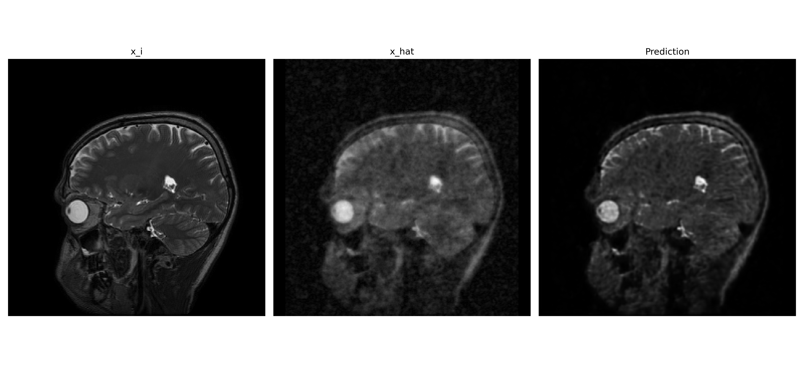

## Installation

```
pip install -r requirements.txt
```

## Usage

### Train

```
python train.py --config config.yaml --mode train
```

### Predict

```
python train.py --config config.yaml --mode predict --checkpoint checkpoint.pth --output_dir predictions
```

## Sample

### image from dataset



### prediction



## Result

| Model | Average PSNR | Average SSIM |
|-------|--------------|--------------|
| ResNet + Decoder| 30.12        | 0.89         |
| CustomCNN| 33.48        | 0.7999         |
| UNet  | 33.61        | 0.8060         |
